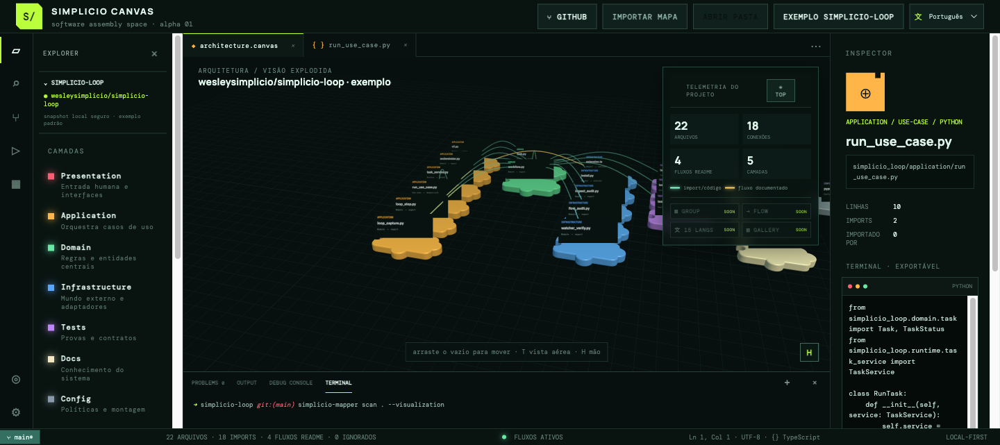
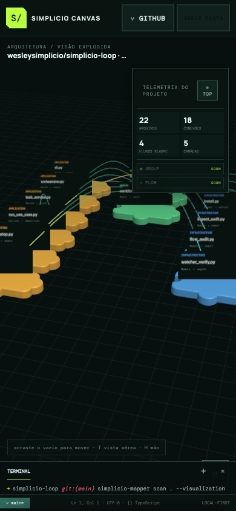
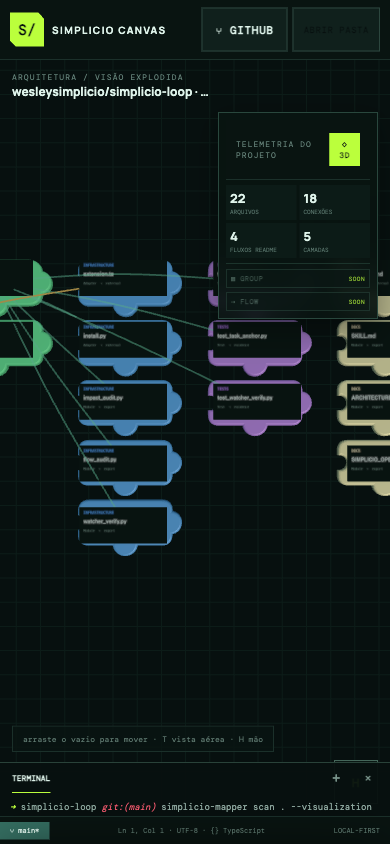
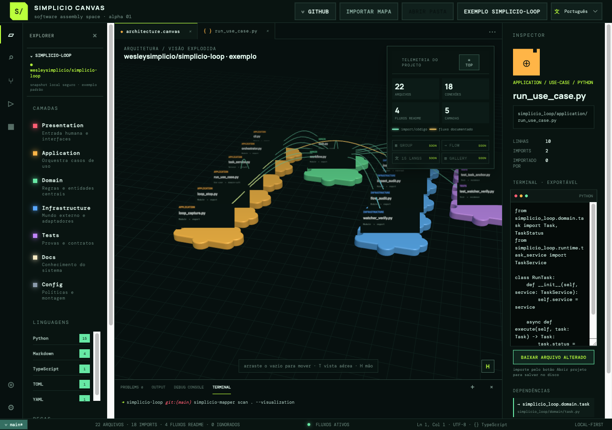

# 🧩 Simplicio Canvas — visual software assembly

<p align="center">
  <strong>English</strong> · <a href="docs/i18n/README.pt-BR.md">Português</a> · <a href="docs/i18n/README.es.md">Español</a> · <a href="docs/i18n/README.fr.md">Français</a> · <a href="docs/i18n/README.de.md">Deutsch</a> · <a href="docs/i18n/README.it.md">Italiano</a> · <a href="docs/i18n/README.nl.md">Nederlands</a> · <a href="docs/i18n/README.pl.md">Polski</a> · <a href="docs/i18n/README.ru.md">Русский</a> · <a href="docs/i18n/README.uk.md">Українська</a> · <a href="docs/i18n/README.tr.md">Türkçe</a> · <a href="docs/i18n/README.ar.md">العربية</a> · <a href="docs/i18n/README.hi.md">हिन्दी</a> · <a href="docs/i18n/README.ja.md">日本語</a> · <a href="docs/i18n/README.zh-CN.md">简体中文</a>
</p>

<p align="center"><a href="https://simpleti.com.br/simplicio_canvas/"><strong>▶ Open the live Canvas 2.9</strong></a></p>

The hosted URL is a secure, read-only visualization of the bundled `simplicio-loop` example. Clone this repository and run the default build locally when you need folder/GitHub import or editing.

The orchestration skill used for the example is available as the Python package [`simplicio-loop==3.31.1`](https://pypi.org/project/simplicio-loop/3.31.1/):

```bash
python3 -m pip install simplicio-loop==3.31.1
```

<p align="center">
  
</p>

<p align="center">
  <a href="https://github.com/wesleysimplicio/simplicio-canvas/actions"></a>
  <a href="https://github.com/wesleysimplicio/simplicio-canvas/blob/main/LICENSE"></a>
  
  
</p>

<p align="center">
  <strong>Open a folder. See its languages, files, imports, and architecture as a workspace you can assemble.</strong>
</p>

---

## ⚡ TL;DR

Simplicio Canvas is an early local-first prototype for visual programming. Its default workspace is the public [`wesleysimplicio/simplicio-loop`](https://github.com/wesleysimplicio/simplicio-loop) project, represented by a safe bundled snapshot. It turns a project folder into colored puzzle pieces on a Three.js canvas inside a VS Code-like workspace:

- **Color** represents the software layer: presentation, application, domain, infrastructure, tests, docs, and configuration.
- **Pieces** represent responsibilities such as screen, service, entity, repository, adapter, and test.
- **Curves** represent real internal imports detected from source files.
- **Click** a file to inspect language, imports, reverse imports, and its source in a read-only terminal.
- **Drag** a piece in the local build to rearrange the architecture view without changing the source tree. The hosted demo is intentionally read-only.

The hosted demo reads only its bundled example. In the local build, selected folders are analyzed in browser memory; GitHub imports use the guarded local bridge or bounded public API fallback. Source contents are not uploaded to a Simplicio service.

## 🚀 Run locally

```bash
git clone https://github.com/wesleysimplicio/simplicio-canvas.git
cd simplicio-canvas
npm install
npm run dev
```

Open the local URL and choose either (the public URL intentionally exposes neither control):

- **Open folder** — authorize a folder already on the machine.
- **GitHub** — enter a public `owner/repository`; the guarded local Vite bridge performs a shallow clone under `.simplicio/workspaces`, attempts `simplicio-mapper`, and the browser has a public-API fallback when the local bridge is unavailable.



The first screen already opens the official `wesleysimplicio/simplicio-loop` example. Run `npm run bootstrap` to emit a local JSON readiness receipt for `simplicio-mapper`, the installed `simplicio-loop` CLI and its project skill. The command is dry-run by default; `node scripts/bootstrap.mjs --repair` is the explicit opt-in repair path.

## 🖥️ Real MVP proof

### VS Code-like workspace


_Measured in a local Playwright session at 1440×641 CSS pixels._

### Native responsive behavior

| Phone portrait | Phone landscape |
|---|---|
|  |  |

| Tablet | Desktop |
|---|---|
|  |  |

The gallery above is captured evidence of the current local build; future Mapper
FLOW and runtime-trace views remain roadmap items until their artifacts are
available.

<details>
<summary>More captured evidence</summary>


</details>

## 🧭 What the MVP analyzes

| Area | Current behavior |
|---|---|
| Languages | TypeScript, JavaScript, Python, Rust, Go, C#, Java, Kotlin, frontend/config formats and documentation |
| Relations | TypeScript/JavaScript and Python imports, with internal path resolution and external package detection |
| Privacy | Local browser memory only; ignores `.git`, `node_modules`, environments, build artifacts, binaries, and files larger than 1 MB |
| Interaction | Orbit, zoom, drag pieces, inspect source and dependencies |
| Rendering | Three.js puzzle pieces, labels, layers and dependency curves |

This is deliberately a static-analysis MVP. It does **not** write source files, run code, or claim complete call-graph accuracy.

## 🗺️ Where it is going

The product direction is semantic zoom rather than a flat graph:

```text
ecosystem → project → layer / flow → file → class / method
```

The next capability is to enrich this view with stable symbols, call graphs, end-to-end flows, safe visual refactors, diff previews, validation, and undo.

The canonical roadmap lives in [GitHub milestones](https://github.com/wesleysimplicio/simplicio-canvas/milestones) and [GitHub issues](https://github.com/wesleysimplicio/simplicio-canvas/issues). Local planning files are reference exports only.

## 🧠 Enriching with simplicio-mapper

For a richer model of a real repository, generate mapper artifacts locally:

```bash
simplicio-mapper scan /path/to/project --sync --await --json
simplicio-mapper inspect /path/to/project --json
```

Then use **Import map** in the UI to load a JSON artifact. The current importer reads artifact paths; consuming the complete mapper symbol, call-graph, and flow contracts is the next integration milestone.

## 🧪 Verification

```bash
npm test
npm run build
```

The domain analyzer and visual grammar are covered by Vitest. Browser proof is captured with Playwright.

## 📜 License

[MIT](LICENSE)

## ⭐ Star History

[](https://www.star-history.com/#wesleysimplicio/simplicio-canvas&Date)
