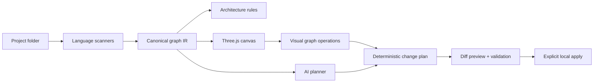

# Simplicio Canvas — product and architecture plan

## Vision

Programming becomes assembly: a repository is parsed into typed puzzle pieces, interfaces become compatible tabs and sockets, dependencies become visible flows, and AI proposes safe graph transformations instead of opaque line edits.

## Visual grammar

Color communicates architectural layer; silhouette communicates software responsibility; tabs are provided contracts; sockets are required contracts; glowing tubes are runtime/static flows; distance means boundary; height means abstraction; opacity means confidence.

| Layer | Color | Meaning |
|---|---|---|
| Presentation | coral `#ff5d73` | screens, CLI, controllers, events |
| Application | amber `#ffb547` | use cases, orchestration, services |
| Domain | mint `#67e8a5` | entities, value objects, rules |
| Infrastructure | blue `#58a6ff` | repositories, adapters, external APIs |
| Tests | violet `#c084fc` | contracts, scenarios, evidence |
| Docs | ivory `#f4e8c1` | decisions, specifications, guides |
| Config | slate `#8b9aab` | composition, policy, deployment |

Piece types: screen emits `event→command`; controller maps `request→use-case`; use-case maps `command→domain-call`; service maps `domain-call→result`; entity maps `rule→state`; repository maps `query→entity`; adapter maps `port→external`; test maps `contract→evidence`; config maps `option→policy`; module maps `import→export`.

## Canonical architecture

The canonical graph IR is the product boundary. Web, VS Code, Cursor and future renderers must consume the same versioned schema. The original project is read-only; demos use a generated path/symbol snapshot with provenance and ignore rules.

## Semantic zoom — the primary interaction model

Zoom is not camera magnification; it changes the semantic representation while preserving spatial context and the selected object.

| Level | Approximate scale | Visible objects | Visible relations | Main action |
|---|---:|---|---|---|
| Z0 Ecosystem | 0–20% | repositories as single recognizable solids | repository dependencies, APIs and shared packages | select/open a project |
| Z1 Project | 20–45% | bounded contexts, architectural layers and entry points | major request, event, data and control flows | select/isolate a flow |
| Z2 Flow | 45–75% | use cases, services, queues, databases and files participating in the flow | calls, publishes, reads, writes, implements and verifies | edit/reverse/add a relation |
| Z3 Symbol | 75–100% | files expanded into imports, classes, functions, methods and tests | imports, calls, inheritance, implementation and symbol references | edit code or graph operation |

Transitions must use animated morphing and hysteresis so objects do not flicker near a threshold. A project piece expands in place into layers; a layer expands into flows; a flow expands into ordered files; a file unfolds into symbols and a local code editor. Breadcrumbs and a minimap always show `ecosystem / project / flow / file / symbol`.

Connections are typed, directional and editable. Arrow shape and motion distinguish `import`, `call`, `data`, `event`, `implements`, `inherits`, `reads`, `writes` and `verifies`. Selecting an edge shows its source location and evidence. Reversing or drawing an arrow creates a proposed code transformation; it never silently changes a dependency. The proposal must show imports to add/remove, affected symbols, architectural violations, diff, tests and an explicit apply button.

Selecting a file exposes all imports it loads and all reverse importers. Selecting a class exposes constructor dependencies, inheritance, implemented interfaces, methods, callers, tests and related runtime/static flows. Double-click opens an embedded editor at the symbol; edits reparse the graph incrementally. Dragging a class between layers is interpreted as a refactor proposal, not as visual-only movement.

Every node and edge has stable identity across rescans. Layout is deterministic and hierarchical, with manual positions stored separately from source truth. Static analysis is authoritative for code relations; inferred AI relations are visibly marked with confidence until verified.

## Non-functional requirements

- Local-first and private by default; no source upload without explicit consent.
- 5k nodes interactive at 45+ FPS on a typical developer laptop; clustering above 500 nodes.
- Incremental re-scan under 500 ms for a changed file after warm-up.
- Every AI edit has plan, diff, impacted tests, validation evidence and undo checkpoint.
- Keyboard navigation, reduced-motion mode, high-contrast palette and non-color layer labels.
- Scanner fixtures for Python and TypeScript; graph schema backward compatibility tests.

## Out of scope before M3

Real-time multi-user collaboration, cloud indexing, marketplace, autonomous code apply, arbitrary language support, and runtime tracing in production.

## Release gates

Each milestone exits only with all child tasks done, unit/domain coverage >=80%, clean build, real browser evidence, zero high-severity dependency findings, and an updated demo snapshot that never contains secrets or source bodies.
