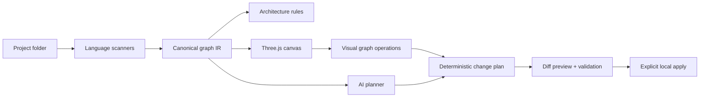

# Simplicio Canvas — product and architecture plan

## Vision

Programming becomes assembly: a repository is parsed into typed puzzle pieces, interfaces become compatible tabs and sockets, dependencies become visible flows, and AI proposes safe graph transformations instead of opaque line edits.

## Visual grammar

Color communicates architectural layer; silhouette communicates software responsibility; tabs are provided contracts; sockets are required contracts; glowing tubes are runtime/static flows; distance means boundary; height means abstraction; opacity means confidence.

| Layer | Color | Meaning |
|---|---|---|
| Presentation | coral `#ff5d73` | screens, CLI, controllers, events |
| Application | amber `#ffb547` | use cases, orchestration, services |
| Domain | mint `#67e8a5` | entities, value objects, rules |
| Infrastructure | blue `#58a6ff` | repositories, adapters, external APIs |
| Tests | violet `#c084fc` | contracts, scenarios, evidence |
| Docs | ivory `#f4e8c1` | decisions, specifications, guides |
| Config | slate `#8b9aab` | composition, policy, deployment |

Piece types: screen emits `event→command`; controller maps `request→use-case`; use-case maps `command→domain-call`; service maps `domain-call→result`; entity maps `rule→state`; repository maps `query→entity`; adapter maps `port→external`; test maps `contract→evidence`; config maps `option→policy`; module maps `import→export`.

## Canonical architecture

The canonical graph IR is the product boundary. Web, VS Code, Cursor and future renderers must consume the same versioned schema. The original project is read-only; demos use a generated path/symbol snapshot with provenance and ignore rules.

## Non-functional requirements

- Local-first and private by default; no source upload without explicit consent.
- 5k nodes interactive at 45+ FPS on a typical developer laptop; clustering above 500 nodes.
- Incremental re-scan under 500 ms for a changed file after warm-up.
- Every AI edit has plan, diff, impacted tests, validation evidence and undo checkpoint.
- Keyboard navigation, reduced-motion mode, high-contrast palette and non-color layer labels.
- Scanner fixtures for Python and TypeScript; graph schema backward compatibility tests.

## Out of scope before M3

Real-time multi-user collaboration, cloud indexing, marketplace, autonomous code apply, arbitrary language support, and runtime tracing in production.

## Release gates

Each milestone exits only with all child tasks done, unit/domain coverage >=80%, clean build, real browser evidence, zero high-severity dependency findings, and an updated demo snapshot that never contains secrets or source bodies.
