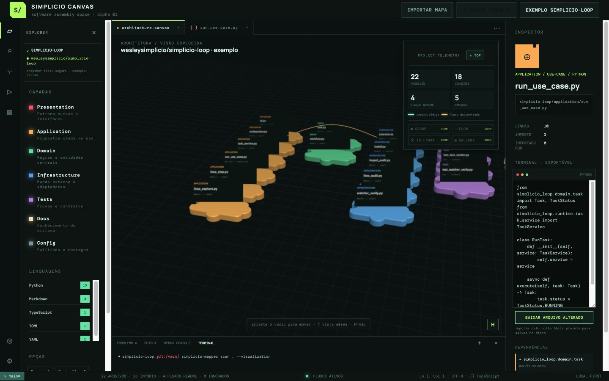

# Simplicio Canvas

[← English](../../README.md) · **Українська**

Локальне візуальне програмування: відкрийте папку та досліджуйте проєкти, шари, потоки, файли й імпорти як з’єднані елементи у Three.js Canvas із середовищем у стилі VS Code.

The default example is the safe snapshot of [`wesleysimplicio/simplicio-loop`](https://github.com/wesleysimplicio/simplicio-loop). The planned bootstrap also prepares `simplicio-mapper` and the local `simplicio-loop` skill.

```bash
git clone https://github.com/wesleysimplicio/simplicio-canvas.git
cd simplicio-canvas && npm install && npm run dev
```

MVP: локальна папка, мови й імпорти, рухомі елементи, 3D-навігація, Explorer, вкладки, термінал/редактор, Inspector та адаптивний інтерфейс. Код залишається локальним.



[Roadmap](https://github.com/wesleysimplicio/simplicio-canvas/issues) · [MIT](../../LICENSE)

